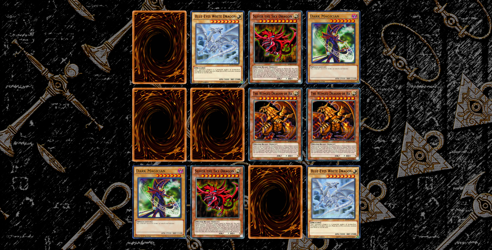

## Yu-Gi-Oh Memory Game
Projeto desenvolvido durante o curso "Desenvolvendo um jogo da memória" oferecido pela **[DigitalInnovationOne](https://digitalinnovation.one/)** e ministrado pela **[@SpruceGabriela](https://github.com/SpruceGabriela)**.

## Tecnologias utilizadas
- HTML5
- CSS3
- Javascript

